# AEGIS Urban — Arquitectura del Sistema

**Documento:** Carpeta de Campo — Sección 1: Arquitectura Técnica  
**Versión:** 1.0 | **Fecha:** 17/05/2026

---

## 1. Decisiones de Stack

| Componente | Elección | Justificación |
|---|---|---|
| **Backend** | Node.js + TypeScript + Express | Un solo lenguaje en todo el stack (TS), ecosistema npm compartido con el frontend, socket.io nativo para WebSockets (Observer), más accesible para un equipo junior |
| **Base de Datos** | PostgreSQL 16 | Soporte nativo de particionamiento por rango (`PARTITION BY RANGE`), `jsonb`, índices parciales, y pg_cron para backups automáticos |
| **Frontend** | React 18 + TypeScript + Vite | |

---

## 2. Estructura de Carpetas — Backend (`aegis-urban-backend/`)

```
aegis-urban-backend/
│
├── src/
│   │
│   ├── config/                              # Configuración global
│   │   ├── database.ts                      # Pool de conexión PostgreSQL (usa Singleton)
│   │   ├── env.ts                           # Validación y tipado de variables de entorno
│   │   ├── i18n.ts                          # Setup de internacionalización backend
│   │   └── socket.ts                        # Configuración inicial del servidor WebSocket
│   │
│   │
│   ├── core/                                # ★ NÚCLEO DE PATRONES DE DISEÑO ★
│   │   │
│   │   ├── singleton/
│   │   │   └── DispatchCore.ts              # [SINGLETON] Núcleo de despacho central.
│   │   │                                    # Única instancia que coordina alertas,
│   │   │                                    # sensores activos y rutas de evacuación.
│   │   │                                    # getInstance() retorna siempre la misma ref.
│   │   │
│   │   ├── factory/
│   │   │   ├── SensorFactory.ts             # [FACTORY METHOD] createSensor(type: SensorType)
│   │   │   │                                # Decide qué subclase instanciar en runtime.
│   │   │   └── sensors/
│   │   │       ├── BaseSensor.ts            # Clase abstracta con interfaz común
│   │   │       ├── FloodSensor.ts           # Producto concreto: Sensor de inundación
│   │   │       ├── FireSensor.ts            # Producto concreto: Sensor de incendio
│   │   │       ├── WindSensor.ts            # Producto concreto: Sensor de viento
│   │   │       └── AirQualitySensor.ts      # Producto concreto: Calidad del aire
│   │   │
│   │   ├── observer/
│   │   │   ├── EventBus.ts                  # [OBSERVER] Bus de eventos interno del servidor.
│   │   │   │                                # Los sensores son Subject, los handlers son Observer.
│   │   │   ├── interfaces/
│   │   │   │   ├── ISubject.ts              # Interface: attach(), detach(), notify()
│   │   │   │   └── IObserver.ts             # Interface: update(event: DomainEvent)
│   │   │   └── handlers/
│   │   │       ├── AlertHandler.ts          # Observer: escucha lecturas críticas → crea alerta
│   │   │       ├── WebSocketEmitter.ts      # Observer: emite evento al frontend por socket.io
│   │   │       └── BitacoraHandler.ts       # Observer: escribe en la bitácora inmutable
│   │   │
│   │   ├── strategy/
│   │   │   ├── EvacuationContext.ts         # [STRATEGY] Contexto que ejecuta la estrategia activa.
│   │   │   │                                # setStrategy(s) + executeRoute() en runtime.
│   │   │   ├── interfaces/
│   │   │   │   └── IEvacuationStrategy.ts   # Interface: calculate(origin, destination): Route
│   │   │   └── strategies/
│   │   │       ├── ShortestPathStrategy.ts  # Estrategia A: Dijkstra — ruta más corta
│   │   │       ├── SafestPathStrategy.ts    # Estrategia B: evita zonas de peligro activo
│   │   │       └── CapacityBasedStrategy.ts # Estrategia C: balancea carga de personas
│   │   │
│   │   └── composite/
│   │       │
│   │       ├── city/                        # [COMPOSITE] Jerarquía geográfica de la ciudad
│   │       │   ├── ICityComponent.ts        # Interface: getName(), getChildren(), addChild()
│   │       │   ├── CityLeaf.ts              # Hoja: Bloque, Edificio — no tiene hijos
│   │       │   └── CityComposite.ts         # Compuesto: Ciudad > Distrito > Zona
│   │       │                                # Permite operaciones recursivas (ej: getSensors())
│   │       │
│   │       └── patent-family/               # [COMPOSITE] Control de acceso por Patentes/Familias
│   │           ├── IPermissionComponent.ts  # Interface: hasPermission(resource, method): bool
│   │           ├── PatentLeaf.ts            # Hoja: permiso atómico (ej: POST /alerts)
│   │           └── FamilyComposite.ts       # Compuesto: Familia agrupa patentes y subfamilias.
│   │                                        # hasPermission() hace OR recursivo de hijos.
│   │
│   │
│   ├── modules/                             # Módulos de feature (MVC por módulo)
│   │   │
│   │   ├── auth/
│   │   │   ├── auth.controller.ts           # POST /auth/login, POST /auth/logout
│   │   │   ├── auth.service.ts              # Valida credenciales, genera JWT, revoca tokens
│   │   │   ├── auth.middleware.ts           # Verifica JWT en cada request protegido
│   │   │   └── jwt.utils.ts                 # sign(), verify(), blacklist check
│   │   │
│   │   ├── users/
│   │   │   ├── user.controller.ts
│   │   │   ├── user.service.ts              # Gestiona encriptación AES de datos sensibles
│   │   │   ├── user.repository.ts           # Queries a PostgreSQL
│   │   │   └── user.types.ts
│   │   │
│   │   ├── sensors/
│   │   │   ├── sensor.controller.ts         # CRUD de sensores, activa/desactiva
│   │   │   ├── sensor.service.ts            # Usa SensorFactory para instanciar tipo correcto
│   │   │   ├── sensor.repository.ts
│   │   │   └── sensor.types.ts
│   │   │
│   │   ├── telemetry/
│   │   │   ├── telemetry.controller.ts      # POST /telemetry (recibe lecturas)
│   │   │   ├── telemetry.service.ts         # Procesa lectura → dispara EventBus si crítico
│   │   │   └── telemetry.repository.ts      # INSERT en SENSOR_READING (tabla particionada)
│   │   │
│   │   ├── alerts/
│   │   │   ├── alert.controller.ts
│   │   │   ├── alert.service.ts             # Gestión del ciclo de vida de la alerta
│   │   │   └── alert.types.ts
│   │   │
│   │   ├── evacuation/
│   │   │   ├── evacuation.controller.ts
│   │   │   └── evacuation.service.ts        # Usa EvacuationContext para elegir estrategia
│   │   │
│   │   ├── city/
│   │   │   ├── city.controller.ts
│   │   │   └── city.service.ts              # Construye árbol CityComposite desde la BD
│   │   │
│   │   └── simulation/                      # ★ MOCKING ENGINE ★
│   │       ├── simulation.controller.ts     # POST /simulation/start, /stop, /status
│   │       ├── simulation.service.ts        # Orquesta el escenario usando SensorFactory
│   │       ├── simulation.engine.ts         # Loop de simulación: genera lecturas falsas
│   │       └── scenarios/
│   │           ├── BaseScenario.ts
│   │           ├── FloodScenario.ts         # Sube valores de sensores de agua gradualmente
│   │           ├── FireScenario.ts
│   │           └── PowerOutScenario.ts
│   │
│   │
│   ├── security/                            # Implementaciones de seguridad
│   │   ├── encryption/
│   │   │   ├── AESCipher.ts                 # encrypt(plainText): string, decrypt(cipher): string
│   │   │   │                                # Clave en env vars, IV aleatorio por cifrado
│   │   │   └── BCryptHasher.ts              # hash(password): string, compare(): boolean
│   │   └── access-control/
│   │       ├── PermissionGuard.ts           # Middleware: construye FamilyComposite del user
│   │       │                                # y llama hasPermission(resource, method)
│   │       └── patent.repository.ts         # Carga patentes/familias del usuario desde BD
│   │
│   │
│   ├── integrity/                           # ★ SISTEMA DVH + DVV ★
│   │   ├── ChecksumCalculator.ts            # calculateDVH(row), calculateChainedDVV()
│   │   ├── IntegrityValidator.ts            # Valida integridad completa de la tabla
│   │   └── BitacoraService.ts               # logEvent(): inserta en AUDIT_LOG con DVH+DVV
│   │                                        # Usa transacción serializable para evitar races
│   │
│   │
│   ├── database/
│   │   ├── migrations/                      # Migraciones SQL versionadas
│   │   ├── seeds/                           # Datos iniciales (admin user, sensor types, etc.)
│   │   ├── partitions/
│   │   │   └── partition.manager.ts         # Crea automáticamente nueva partición cada trimestre
│   │   └── backup/
│   │       ├── BackupScheduler.ts           # node-cron: ejecuta pg_dump cada 24hs
│   │       └── RestoreService.ts            # Restaura desde backup usando psql subprocess
│   │
│   │
│   ├── websocket/                           # Capa WebSocket (materializa el patrón Observer)
│   │   ├── WebSocketServer.ts               # Inicializa socket.io, gestiona rooms por zona
│   │   └── events/
│   │       ├── alert.events.ts              # Tipos de eventos: 'alert:new', 'alert:resolved'
│   │       └── sensor.events.ts             # 'sensor:reading', 'sensor:fault'
│   │
│   │
│   ├── i18n/                                # Traducciones del backend
│   │   ├── es.json
│   │   └── en.json
│   │
│   │
│   ├── shared/
│   │   ├── errors/
│   │   │   ├── AppError.ts                  # Clase base de errores de dominio
│   │   │   └── error.middleware.ts          # Express error handler global
│   │   ├── types/
│   │   │   ├── domain.types.ts              # Tipos compartidos de dominio
│   │   │   └── express.d.ts                 # Augmenta Request con req.user
│   │   └── utils/
│   │       └── pagination.ts
│   │
│   └── app.ts                               # Bootstrap de Express + middlewares globales
│
├── tests/
│   ├── unit/
│   │   ├── core/                            # Tests de patrones: Singleton, Factory, etc.
│   │   └── integrity/                       # Tests de DVH/DVV (críticos)
│   └── integration/
│
├── docker-compose.yml
├── Dockerfile
├── .env.example
├── package.json
└── tsconfig.json
```

---

## 3. Estructura de Carpetas — Frontend (`aegis-urban-frontend/`)

```
aegis-urban-frontend/
│
├── public/
│   └── locales/                             # Archivos de traducción para i18next
│       ├── es/
│       │   └── translation.json
│       └── en/
│           └── translation.json
│
├── src/
│   │
│   ├── router/
│   │   └── AppRouter.tsx                    # ★ LAZY LOADING ★ — todas las páginas con
│   │                                        # React.lazy() + <Suspense fallback={<Spinner/>}>
│   │
│   ├── pages/                               # Cada página = chunk separado (code splitting)
│   │   ├── Login/
│   │   │   └── LoginPage.tsx
│   │   ├── Dashboard/
│   │   │   └── DashboardPage.tsx
│   │   ├── CityMap/
│   │   │   └── CityMapPage.tsx              # ← Lazy loaded: librería Leaflet (~500kb)
│   │   │                                    #   se descarga SOLO cuando el usuario navega
│   │   ├── Sensors/
│   │   │   └── SensorsPage.tsx
│   │   ├── Alerts/
│   │   │   └── AlertsPage.tsx
│   │   ├── Simulation/
│   │   │   └── SimulationPage.tsx
│   │   ├── Reports/
│   │   │   └── ReportsPage.tsx
│   │   └── Admin/
│   │       └── AdminPage.tsx
│   │
│   ├── components/
│   │   │
│   │   ├── common/                          # Componentes atómicos reutilizables
│   │   │   ├── Button/
│   │   │   ├── Modal/
│   │   │   ├── Table/
│   │   │   ├── Spinner/
│   │   │   └── HelpTooltip/                 # ★ AYUDA CONTEXTUAL ★
│   │   │       ├── HelpTooltip.tsx          # Recibe helpKey="sensors.filter",
│   │   │       └── helpContent.ts           # muestra texto del JSON de i18n
│   │   │
│   │   ├── map/                             # Componentes del mapa de ciudad
│   │   │   ├── CityMap.tsx                  # Contenedor principal Leaflet
│   │   │   │                                # ★ LAZY LOADING DE TILES ★: solo carga
│   │   │   │                                #   tiles del viewport visible
│   │   │   ├── SensorMarker.tsx             # Marker por sensor con color según estado
│   │   │   ├── ZoneOverlay.tsx              # Polígono de zona (renderiza árbol Composite)
│   │   │   └── EvacuationRoute.tsx          # Dibuja la ruta calculada por Strategy
│   │   │
│   │   ├── alerts/
│   │   │   ├── AlertPanel.tsx               # Panel lateral de alertas activas
│   │   │   ├── AlertCard.tsx
│   │   │   └── AlertBadge.tsx               # Contador en tiempo real (WebSocket)
│   │   │
│   │   ├── simulation/
│   │   │   ├── ScenarioSelector.tsx         # Selector de escenario del Mocking Engine
│   │   │   └── SimulationControls.tsx       # Start / Stop / Speed de simulación
│   │   │
│   │   └── layout/
│   │       ├── Sidebar.tsx
│   │       ├── Header.tsx
│   │       └── LanguageSwitcher.tsx         # Selector ES/EN
│   │
│   ├── hooks/                               # Custom hooks
│   │   ├── useWebSocket.ts                  # ★ OBSERVER (cliente) ★ — conecta socket.io,
│   │   │                                    #   suscribe a eventos y actualiza store global
│   │   ├── useAuth.ts
│   │   ├── useSensors.ts
│   │   └── useI18n.ts
│   │
│   ├── store/                               # Estado global con Zustand
│   │   ├── alertStore.ts
│   │   ├── sensorStore.ts
│   │   ├── authStore.ts
│   │   └── simulationStore.ts
│   │
│   ├── services/                            # ★ MINIMIZACIÓN DE PETICIONES ★
│   │   ├── api.ts                           # Axios + interceptor JWT + deduplicación
│   │   ├── cache/
│   │   │   ├── RequestCache.ts              # Map<url, {data, expiresAt}>: GET /sensors
│   │   │   │                                # cachea 30s antes de re-pedir al servidor
│   │   │   └── PersistentCache.ts           # localStorage para datos entre reloads
│   │   ├── authService.ts
│   │   ├── sensorService.ts
│   │   ├── alertService.ts
│   │   └── evacuationService.ts
│   │
│   ├── i18n/
│   │   └── index.ts                         # i18next: detecta idioma, fallback 'es'
│   │
│   ├── context/
│   │   └── AuthContext.tsx                  # Árbol de permisos del usuario logueado
│   │
│   └── types/
│       ├── sensor.types.ts
│       ├── alert.types.ts
│       └── user.types.ts
│
├── package.json
├── vite.config.ts                           # Configura chunks manuales para code splitting
└── tsconfig.json
```

---

## 4. Modelo Entidad-Relación (DER Lógico)

```mermaid
erDiagram

    %% ════════════════════════════════════════════
    %%  MÓDULO: PATENTES Y FAMILIAS (Composite)
    %% ════════════════════════════════════════════

    PATENT {
        int     id_patent    PK
        varchar code         UK  "Ej: ALERT_CREATE"
        varchar description
        varchar resource         "Ej: /api/alerts"
        varchar http_method      "GET|POST|PUT|DELETE"
        boolean is_active
        timestamp created_at
    }

    FAMILY {
        int     id_family        PK
        varchar name             UK  "Ej: OPERATOR, ADMIN"
        varchar description
        int     id_parent_family FK  "NULL = raíz. Permite jerarquía Composite"
        boolean is_active
        timestamp created_at
    }

    FAMILY_PATENT {
        int id_family  PK,FK
        int id_patent  PK,FK
    }

    %% ════════════════════════════════════════════
    %%  MÓDULO: USUARIOS Y SESIONES
    %% ════════════════════════════════════════════

    USERS {
        int       id_user        PK
        varchar   username       UK
        varchar   email          UK
        varchar   password_hash      "BCrypt — irreversible"
        varchar   full_name_enc      "AES-256-CBC — reversible"
        varchar   dni_enc            "AES-256-CBC — reversible"
        varchar   phone_enc          "AES-256-CBC — reversible"
        int       id_family      FK
        boolean   is_active
        timestamp created_at
        timestamp last_login
    }

    SESSION_TOKEN {
        int       id_token       PK
        int       id_user        FK
        varchar   token_hash         "SHA-256 del JWT completo"
        varchar   ip_address
        varchar   user_agent
        boolean   is_revoked
        timestamp issued_at
        timestamp expires_at
    }

    %% ════════════════════════════════════════════
    %%  MÓDULO: CIUDAD (Composite geográfico)
    %% ════════════════════════════════════════════

    CITY_NODE {
        int      id_node        PK
        varchar  name
        varchar  node_type          "CITY|DISTRICT|ZONE|BLOCK"
        int      id_parent      FK  "NULL = Ciudad raíz"
        decimal  centroid_lat
        decimal  centroid_lon
        jsonb    boundary_geojson   "Polígono para el mapa"
        boolean  is_active
    }

    %% ════════════════════════════════════════════
    %%  MÓDULO: SENSORES (Factory Method)
    %% ════════════════════════════════════════════

    SENSOR_TYPE {
        int     id_sensor_type  PK
        varchar code            UK  "FLOOD|FIRE|WIND|AIR_QUALITY"
        varchar class_name          "FloodSensor — Factory usa esto"
        varchar unit                "mm|°C|km/h|AQI"
        decimal alert_threshold
        decimal critical_threshold
    }

    SENSOR {
        int       id_sensor       PK
        varchar   serial_code     UK
        int       id_sensor_type  FK
        int       id_city_node    FK
        varchar   status              "ACTIVE|INACTIVE|FAULT|SIMULATED"
        decimal   lat
        decimal   lon
        timestamp installed_at
        timestamp last_ping
        boolean   is_simulated
    }

    %% ════════════════════════════════════════════
    %%  MÓDULO: TELEMETRÍA — TABLA PARTICIONADA
    %%  Estrategia: PARTITION BY RANGE (recorded_at)
    %%  Particiones: p_2025_q1, p_2025_q2, p_2026_q1...
    %% ════════════════════════════════════════════

    SENSOR_READING {
        bigint    id_reading      PK  "GENERATED ALWAYS AS IDENTITY"
        int       id_sensor       FK
        decimal   value
        varchar   unit
        varchar   reading_status      "OK|WARNING|CRITICAL"
        boolean   is_simulated
        timestamp recorded_at        "★ PARTITION KEY — índice automático"
    }

    %% ════════════════════════════════════════════
    %%  MÓDULO: ALERTAS Y EVACUACIÓN
    %% ════════════════════════════════════════════

    ALERT {
        int       id_alert        PK
        int       id_sensor       FK
        varchar   level               "WARNING|CRITICAL|CATASTROPHIC"
        varchar   alert_type          "FLOOD|FIRE|WIND|POWER_OUT"
        text      message
        varchar   status              "ACTIVE|ACKNOWLEDGED|RESOLVED"
        int       acknowledged_by FK  "→ USERS"
        timestamp created_at
        timestamp acknowledged_at
        timestamp resolved_at
    }

    EVACUATION_PLAN {
        int       id_plan         PK
        int       id_alert        FK
        varchar   strategy_used       "SHORTEST|SAFEST|CAPACITY"
        jsonb     route_geojson       "LineString con puntos de evacuación"
        int       estimated_people
        varchar   status              "CALCULATED|ACTIVE|COMPLETED"
        timestamp created_at
    }

    %% ════════════════════════════════════════════
    %%  MÓDULO: BITÁCORA INMUTABLE CON DVH + DVV
    %%  ★ NUNCA se hace UPDATE ni DELETE en esta tabla ★
    %% ════════════════════════════════════════════

    AUDIT_LOG {
        bigint    id_log          PK  "Secuencial estricto, sin gaps"
        varchar   action              "LOGIN|LOGOUT|SENSOR_CREATE|ALERT_ACK..."
        varchar   entity_name         "Tabla afectada"
        varchar   entity_id           "PK del registro afectado"
        int       id_user         FK
        varchar   ip_address
        text      old_values          "JSON antes del cambio (NULL en INSERT)"
        text      new_values          "JSON después del cambio (NULL en DELETE)"
        varchar   dvh                 "SHA-256 de los campos de esta fila"
        varchar   dvv                 "Hash encadenado acumulado hasta esta fila"
        timestamp created_at          "Timestamp con timezone"
    }

    AUDIT_LOG_CONTROL {
        int       id_control      PK
        varchar   table_name      UK  "Siempre 'AUDIT_LOG'"
        bigint    total_rows
        varchar   last_dvv            "DVV de la última fila"
        timestamp last_verified
        varchar   verified_by
    }

    %% ════════════════════════════════════════════
    %%  MÓDULO: SIMULACIÓN (Mocking Engine)
    %% ════════════════════════════════════════════

    SIMULATION_SCENARIO {
        int       id_scenario     PK
        varchar   name
        varchar   scenario_type       "FLOOD|FIRE|POWER_OUT|COMBINED"
        jsonb     config              "intensidad, duración, id_city_node objetivo"
        int       created_by      FK  "→ USERS"
        varchar   status              "DRAFT|RUNNING|COMPLETED|ABORTED"
        timestamp started_at
        timestamp ended_at
    }

    SIMULATION_EVENT {
        int       id_event        PK
        int       id_scenario     FK
        int       id_sensor       FK
        decimal   simulated_value
        varchar   trigger_type        "AUTO|MANUAL"
        timestamp fired_at
    }

    %% ════════════════════════════════════════════
    %%  RELACIONES
    %% ════════════════════════════════════════════

    FAMILY         ||--o{  FAMILY         : "es padre de (Composite recursivo)"
    FAMILY         ||--o{  FAMILY_PATENT  : "agrupa"
    PATENT         ||--o{  FAMILY_PATENT  : "pertenece a"
    USERS          }o--||  FAMILY         : "tiene asignada"
    USERS          ||--o{  SESSION_TOKEN  : "genera"

    CITY_NODE      ||--o{  CITY_NODE      : "contiene (Composite recursivo)"
    CITY_NODE      ||--o{  SENSOR         : "aloja"
    SENSOR_TYPE    ||--o{  SENSOR         : "define tipo"

    SENSOR         ||--o{  SENSOR_READING : "produce lecturas"
    SENSOR         ||--o{  ALERT          : "dispara"

    ALERT          ||--o{  EVACUATION_PLAN : "origina"
    USERS          ||--o{  ALERT           : "acknowledges"

    USERS          ||--o{  AUDIT_LOG       : "genera eventos"

    USERS          ||--o{  SIMULATION_SCENARIO : "crea"
    SIMULATION_SCENARIO ||--o{ SIMULATION_EVENT : "contiene"
    SIMULATION_EVENT    }o--|| SENSOR            : "afecta virtualmente"
```



---

## 5. Sistema DVH + DVV — Fundamento Matemático

Imagina la `AUDIT_LOG` como una **grilla de datos**. Los Dígitos Verificadores protegen en dos ejes:

```
FILA 1  →  DVH₁ = SHA256(id₁ | action₁ | entity₁ | user₁ | ip₁ | values₁ | ts₁)
FILA 2  →  DVH₂ = SHA256(id₂ | action₂ | entity₂ | user₂ | ip₂ | values₂ | ts₂)
FILA 3  →  DVH₃ = SHA256(...)
                ↓
           DVV₁ = DVH₁
           DVV₂ = SHA256(DVV₁ + "|" + DVH₂)   ← depende de TODAS las anteriores
           DVV₃ = SHA256(DVV₂ + "|" + DVH₃)   ← si se borra fila 1, DVV₂ falla
```

**Lo que detecta cada verificador:**

| Ataque | DVH detecta | DVV detecta |
|---|:---:|:---:|
| Modificar un campo de la fila 5 | ✅ DVH₅ cambia | ✅ DVV₅, DVV₆... cambian |
| Eliminar la fila 3 | ❌ No aplica | ✅ DVV₃ en adelante queda roto |
| Insertar una fila falsa | ❌ Tendría DVH válido | ✅ El DVV de esa posición no coincide |
| Modificar DVH directamente | ❌ DVH falseado | ✅ DVV incluye el DVH original |

---

## 6. Código — `ChecksumCalculator.ts`

```typescript
// src/integrity/ChecksumCalculator.ts
import crypto from 'crypto';

export interface AuditLogRow {
  id_log:       bigint;
  action:       string;
  entity_name:  string;
  entity_id:    string;
  id_user:      number;
  ip_address:   string;
  old_values:   string | null;
  new_values:   string | null;
  dvh:          string;
  dvv:          string;
  created_at:   Date;
}

export interface IntegrityResult {
  isValid:      boolean;
  corruptedRow: bigint | null;
  reason:       string;
}

export class ChecksumCalculator {

  // Separador ASCII que no puede aparecer en los datos
  private static readonly SEP = '\x1F';

  /**
   * DVH — Dígito Verificador Horizontal
   *
   * Concatena los 9 campos críticos de la fila usando separador de unidad ASCII (0x1F)
   * para evitar colisiones del tipo:
   *   action="LO" + entity="GIN"  vs  action="LOG" + entity="IN"
   *
   * @returns string hex de 64 chars (SHA-256 = 256 bits)
   */
  static calculateDVH(row: Omit<AuditLogRow, 'dvh' | 'dvv'>): string {
    const payload = [
      row.id_log.toString(),
      row.action,
      row.entity_name,
      row.entity_id,
      row.id_user.toString(),
      row.ip_address,
      row.old_values ?? '',
      row.new_values ?? '',
      row.created_at.toISOString(),   // ISO 8601 con timezone — determinístico
    ].join(this.SEP);

    return crypto
      .createHash('sha256')
      .update(payload, 'utf8')
      .digest('hex');
  }

  /**
   * DVV — Dígito Verificador Vertical (encadenado tipo blockchain)
   *
   *   - Primera fila: DVV₁ = DVH₁
   *   - Fila N:       DVVₙ = SHA256( DVVₙ₋₁ + SEP + DVHₙ )
   *
   * @param previousDVV  DVV de la fila anterior. NULL solo para la primera fila.
   * @param currentDVH   DVH recién calculado para la fila actual.
   */
  static calculateChainedDVV(
    previousDVV: string | null,
    currentDVH:  string
  ): string {
    if (previousDVV === null) {
      return currentDVH;
    }

    const chain = `${previousDVV}${this.SEP}${currentDVH}`;
    return crypto
      .createHash('sha256')
      .update(chain, 'utf8')
      .digest('hex');
  }

  /**
   * Valida la integridad COMPLETA de la tabla.
   *
   * Recorre todas las filas en ORDER BY id_log ASC y recalcula DVH + DVV desde cero.
   * Ejecutar en transacción READ ONLY con aislamiento SERIALIZABLE.
   *
   * Complejidad: O(n)
   */
  static validateTableIntegrity(rows: AuditLogRow[]): IntegrityResult {
    if (rows.length === 0) {
      return { isValid: true, corruptedRow: null, reason: 'Tabla vacía — OK' };
    }

    let previousDVV: string | null = null;

    for (const row of rows) {

      // ── PASO 1: Verificar DVH de esta fila ──────────────────────────
      const expectedDVH = this.calculateDVH(row);

      if (expectedDVH !== row.dvh) {
        return {
          isValid: false,
          corruptedRow: row.id_log,
          reason: `Fila ${row.id_log}: DVH inválido. ` +
                  `Almacenado=${row.dvh.slice(0, 16)}... ` +
                  `Calculado=${expectedDVH.slice(0, 16)}... ` +
                  `— Un campo de esta fila fue modificado directamente en BD.`,
        };
      }

      // ── PASO 2: Verificar DVV encadenado ────────────────────────────
      const expectedDVV = this.calculateChainedDVV(previousDVV, expectedDVH);

      if (expectedDVV !== row.dvv) {
        return {
          isValid: false,
          corruptedRow: row.id_log,
          reason: `Fila ${row.id_log}: DVV roto. ` +
                  `El encadenamiento no coincide. ` +
                  `— Se eliminó, insertó o reordenó una fila antes de esta posición.`,
        };
      }

      previousDVV = expectedDVV;
    }

    return {
      isValid: true,
      corruptedRow: null,
      reason: `${rows.length} filas verificadas — integridad confirmada`,
    };
  }
}
```

---

## 7. Código — `BitacoraService.ts`

```typescript
// src/integrity/BitacoraService.ts
import { Pool } from 'pg';
import { ChecksumCalculator, AuditLogRow } from './ChecksumCalculator';

export interface AuditEvent {
  action:     string;
  entityName: string;
  entityId:   string;
  userId:     number;
  ipAddress:  string;
  oldValues?: Record<string, unknown>;
  newValues?: Record<string, unknown>;
}

export class BitacoraService {

  constructor(private readonly db: Pool) {}

  /**
   * Inserta un evento en la bitácora de forma ATÓMICA.
   *
   * Flujo:
   *  1. Inicia transacción SERIALIZABLE
   *  2. Lee DVV de la última fila (FOR UPDATE — lock exclusivo)
   *  3. Obtiene próximo id_log via secuencia PostgreSQL
   *  4. Construye objeto de fila sin DVH ni DVV
   *  5. Calcula DVH de esos datos
   *  6. Calcula DVV encadenando con el DVV anterior
   *  7. Inserta fila completa con DVH y DVV
   *  8. Actualiza AUDIT_LOG_CONTROL
   *  9. Commit
   */
  async logEvent(event: AuditEvent): Promise<void> {
    const client = await this.db.connect();

    try {
      // 1. Transacción serializable
      await client.query('BEGIN TRANSACTION ISOLATION LEVEL SERIALIZABLE');

      // 2. Obtener DVV de la última fila con lock exclusivo
      const lastRowResult = await client.query<{ dvv: string }>(`
        SELECT dvv FROM audit_log
        ORDER BY id_log DESC LIMIT 1
        FOR UPDATE
      `);

      const previousDVV: string | null =
        lastRowResult.rows.length > 0 ? lastRowResult.rows[0].dvv : null;

      // 3. Siguiente ID de la secuencia
      const nextIdResult = await client.query<{ nextval: string }>(
        `SELECT nextval('audit_log_id_log_seq') AS nextval`
      );
      const nextId = BigInt(nextIdResult.rows[0].nextval);
      const createdAt = new Date();

      // 4. Preparar datos de la fila
      const rowData: Omit<AuditLogRow, 'dvh' | 'dvv'> = {
        id_log:      nextId,
        action:      event.action,
        entity_name: event.entityName,
        entity_id:   event.entityId,
        id_user:     event.userId,
        ip_address:  event.ipAddress,
        old_values:  event.oldValues ? JSON.stringify(event.oldValues) : null,
        new_values:  event.newValues ? JSON.stringify(event.newValues) : null,
        created_at:  createdAt,
      };

      // 5. Calcular DVH
      const dvh = ChecksumCalculator.calculateDVH(rowData);

      // 6. Calcular DVV encadenado
      const dvv = ChecksumCalculator.calculateChainedDVV(previousDVV, dvh);

      // 7. INSERT con DVH y DVV
      await client.query(`
        INSERT INTO audit_log (
          id_log, action, entity_name, entity_id,
          id_user, ip_address, old_values, new_values,
          dvh, dvv, created_at
        ) VALUES ($1,$2,$3,$4,$5,$6,$7,$8,$9,$10,$11)
      `, [
        nextId, event.action, event.entityName, event.entityId,
        event.userId, event.ipAddress,
        rowData.old_values, rowData.new_values,
        dvh, dvv, createdAt,
      ]);

      // 8. Actualizar tabla de control
      await client.query(`
        UPDATE audit_log_control
        SET total_rows = total_rows + 1, last_dvv = $1
        WHERE table_name = 'audit_log'
      `, [dvv]);

      await client.query('COMMIT');

    } catch (err) {
      await client.query('ROLLBACK');
      throw err;
    } finally {
      client.release();
    }
  }
}
```

---

## 8. SQL — Tabla `AUDIT_LOG` con Restricciones de Integridad

```sql
-- migrations/005_create_audit_log.sql

CREATE SEQUENCE audit_log_id_log_seq
    START WITH 1
    INCREMENT BY 1
    NO MINVALUE
    NO MAXVALUE
    CACHE 1;

CREATE TABLE audit_log (
    id_log       BIGINT       DEFAULT nextval('audit_log_id_log_seq') PRIMARY KEY,
    action       VARCHAR(50)  NOT NULL,
    entity_name  VARCHAR(100) NOT NULL,
    entity_id    VARCHAR(255) NOT NULL,
    id_user      INTEGER      NOT NULL REFERENCES users(id_user),
    ip_address   VARCHAR(45)  NOT NULL,
    old_values   TEXT,
    new_values   TEXT,
    dvh          CHAR(64)     NOT NULL,  -- SHA-256 = siempre 64 hex chars
    dvv          CHAR(64)     NOT NULL,  -- SHA-256 = siempre 64 hex chars
    created_at   TIMESTAMPTZ  NOT NULL DEFAULT NOW()
);

CREATE INDEX idx_audit_log_user    ON audit_log (id_user);
CREATE INDEX idx_audit_log_created ON audit_log (created_at DESC);

-- ★ REVOCAR UPDATE y DELETE al rol de la aplicación ★
REVOKE UPDATE, DELETE ON audit_log FROM aegis_app_user;

CREATE TABLE audit_log_control (
    id_control    SERIAL       PRIMARY KEY,
    table_name    VARCHAR(100) UNIQUE NOT NULL DEFAULT 'audit_log',
    total_rows    BIGINT       DEFAULT 0,
    last_dvv      CHAR(64),
    last_verified TIMESTAMPTZ,
    verified_by   VARCHAR(100)
);

INSERT INTO audit_log_control (table_name, total_rows) VALUES ('audit_log', 0);
```

---

## 9. Ejemplo Numérico de Secuencia DVH/DVV

```
── Fila 1 insertada ───────────────────────────────────────────────
  Datos: id=1 | LOGIN | users | 42 | admin | 192.168.1.1 | 2026-05-17T10:00:00Z

  DVH₁ = SHA256("1\x1FLOGIN\x1Fusers\x1F42\x1Fadmin\x1F192.168.1.1\x1F\x1F...\x1F2026-05-17T10:00:00.000Z")
       = "a3f5c1..." (64 chars hex)

  DVV₁ = DVH₁  (primera fila, no hay anterior)
       = "a3f5c1..."

── Fila 2 insertada ───────────────────────────────────────────────
  DVH₂ = SHA256("2\x1FSENSOR_CREATE\x1F...")
       = "b82e44..."

  DVV₂ = SHA256("a3f5c1...\x1Fb82e44...")
       = "d91a03..."

── Alguien borra la Fila 1 directamente en la BD ──────────────────
  Al validar, la primera fila que se lee ahora es la que tenía id=2:

  Recalculo DVV₂:
    previousDVV = null  (es la primera fila visible)
    expectedDVV = DVH₂ = "b82e44..."

  DVV almacenado en fila 2 = "d91a03..."  ← ¡NO COINCIDE!
  → RESULTADO: IntegrityResult { isValid: false, corruptedRow: 2n,
      reason: "Fila 2: DVV roto — fila eliminada antes de esta posición" }
```

---

*Fin del documento 01 — AEGIS Urban · Arquitectura, DER y DVH/DVV · v1.0 · 17/05/2026*
