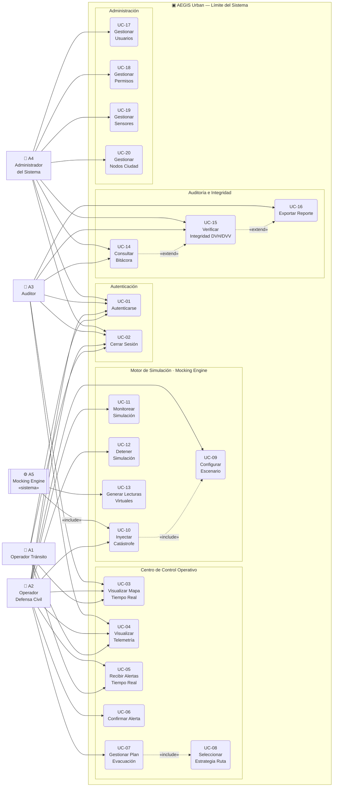
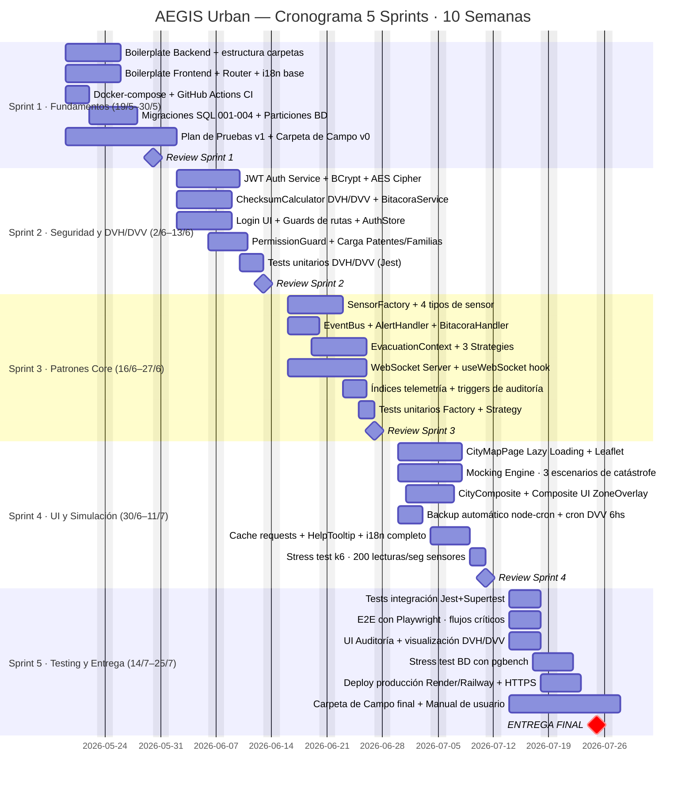

# AEGIS Urban — Análisis, Diseño y Planificación (SDLC)

**Documento:** Carpeta de Campo — Sección 2: Análisis y Diseño del Sistema  
**Versión:** 1.0 | **Fecha:** 17/05/2026

---

## SECCIÓN 1 — DIAGRAMA DE CASOS DE USO (UML)

### 1.1 Actores del Sistema

| ID | Actor | Tipo | Descripción funcional |
|---|---|---|---|
| A1 | Operador Tránsito | Externo — Humano | Monitorea el mapa en tiempo real, visualiza telemetría y recibe alertas automáticas |
| A2 | Operador Defensa Civil | Externo — Humano | Gestiona el ciclo completo de crisis: confirma alertas, activa evacuaciones, opera el Mocking Engine |
| A3 | Auditor | Externo — Humano | Consulta la bitácora inmutable, verifica integridad DVH/DVV y exporta reportes |
| A4 | Administrador Sistema | Externo — Humano | Gestiona usuarios, permisos (Patentes/Familias), sensores y nodos geográficos |
| A5 | Mocking Engine | Interno — **Sistema** | Actor de sistema que genera lecturas virtuales e inyecta escenarios de catástrofe |

### 1.2 Catálogo de Casos de Uso

| Código | Nombre | Actor(es) | Módulo |
|---|---|---|---|
| UC-01 | Autenticarse en el Sistema | A1, A2, A3, A4 | Auth |
| UC-02 | Cerrar Sesión | A1, A2, A3, A4 | Auth |
| UC-03 | Visualizar Mapa de Ciudad en Tiempo Real | A1, A2, A3 | Operaciones |
| UC-04 | Visualizar Telemetría de Sensores | A1, A2, A3 | Operaciones |
| UC-05 | Recibir Alertas en Tiempo Real | A1, A2 | Operaciones |
| UC-06 | Confirmar Alerta (Acknowledge) | A2 | Operaciones |
| UC-07 | Gestionar Plan de Evacuación | A2 | Operaciones |
| UC-08 | Seleccionar Estrategia de Evacuación | A2 | Operaciones |
| UC-09 | Configurar Escenario de Simulación | A2 | Simulación |
| UC-10 | Inyectar Catástrofe | A2, A5 | Simulación |
| UC-11 | Monitorear Simulación Activa | A2 | Simulación |
| UC-12 | Detener Simulación | A2 | Simulación |
| UC-13 | Generar Lecturas Virtuales de Sensores | A5 | Simulación |
| UC-14 | Consultar Bitácora de Auditoría | A3, A4 | Auditoría |
| UC-15 | Verificar Integridad DVH/DVV | A3, A4 | Auditoría |
| UC-16 | Exportar Reporte de Auditoría | A3 | Auditoría |
| UC-17 | Gestionar Usuarios | A4 | Administración |
| UC-18 | Gestionar Permisos (Patentes/Familias) | A4 | Administración |
| UC-19 | Gestionar Sensores | A4 | Administración |
| UC-20 | Gestionar Nodos de Ciudad | A4 | Administración |

### 1.3 Relaciones Include / Extend

| Relación | Tipo | Explicación |
|---|---|---|
| UC-07 `<<include>>` UC-08 | Include | Gestionar evacuación **siempre** requiere seleccionar una estrategia de ruta |
| UC-10 `<<include>>` UC-09 | Include | Inyectar catástrofe **siempre** requiere un escenario configurado previamente |
| UC-14 `<<extend>>` UC-15 | Extend | Al consultar la bitácora, el usuario **puede opcionalmente** lanzar verificación de integridad |
| UC-15 `<<extend>>` UC-16 | Extend | Al verificar integridad, el usuario **puede opcionalmente** exportar el reporte resultante |
| A5 `<<include>>` UC-10 | Include | El Mocking Engine **siempre** participa en la ejecución de UC-10 como actor interno |

### 1.4 Diagrama Mermaid

> **Nota:** Mermaid no soporta diagramas UML de Casos de Uso de forma nativa. Se usa `flowchart LR` como representación equivalente. Actores humanos: rectángulo `[...]`. Actor de sistema (Mocking Engine): doble rectángulo `[[...]]`.



---

## SECCIÓN 2 — DIAGRAMA DE CLASES: NÚCLEO DE PATRONES

### 2.1 Inventario de Patrones

| Patrón | Clase Principal | Propósito en AEGIS Urban |
|---|---|---|
| **Singleton** | `EmergencyKernel` | Única instancia que orquesta sensores, alertas y evacuaciones |
| **Factory Method** | `SensorFactory` | Crea `FloodSensor`, `FireSensor`, etc. según tipo configurado en BD |
| **Observer** | `EventBus` + `IObserver` | Desacopla detección de lecturas críticas de alertas, logs y WebSocket |
| **Strategy** | `EvacuationContext` | Intercambia en runtime el algoritmo de cálculo de rutas de evacuación |
| **Composite (ciudad)** | `ICityComponent` | Trata Bloque individual y Ciudad completa con la misma interfaz recursiva |
| **Composite (permisos)** | `IPermissionComponent` | `FamilyComposite.hasPermission()` evalúa permisos recursivamente |

### 2.2 Diagrama Mermaid

```mermaid
classDiagram
    direction TB

    %% ═══════════════════════════════════════
    %% PATRÓN SINGLETON
    %% ═══════════════════════════════════════
    class EmergencyKernel {
        -instance: EmergencyKernel$
        -sensorFactory: SensorFactory
        -evacuationContext: EvacuationContext
        -eventBus: EventBus
        -activeSensors: Map~string,BaseSensor~
        -activeAlerts: Alert[]
        -EmergencyKernel()
        +getInstance()$ EmergencyKernel
        +registerSensor(type: SensorType, cfg: SensorConfig) void
        +processReading(reading: SensorReading) void
        +dispatchEvacuation(alertId: string, strategy: string) Route
        +getSystemStatus() SystemStatus
    }

    %% ═══════════════════════════════════════
    %% PATRÓN FACTORY METHOD
    %% ═══════════════════════════════════════
    class SensorFactory {
        +createSensor(type: SensorType, cfg: SensorConfig)$ BaseSensor
    }
    class BaseSensor {
        <<abstract>>
        #sensorId: string
        #serialCode: string
        #location: GeoPoint
        #status: SensorStatus
        +read()* SensorReading
        +validate(value: number)* boolean
        +getAlertThreshold()* number
    }
    class FloodSensor {
        -waterLevelThreshold: number
        +read() SensorReading
        +validate(value: number) boolean
        +getAlertThreshold() number
    }
    class FireSensor {
        -temperatureThreshold: number
        +read() SensorReading
        +validate(value: number) boolean
        +getAlertThreshold() number
    }
    class WindSensor {
        -windSpeedThreshold: number
        +read() SensorReading
        +validate(value: number) boolean
        +getAlertThreshold() number
    }

    %% ═══════════════════════════════════════
    %% PATRÓN OBSERVER
    %% ═══════════════════════════════════════
    class EventBus {
        -observers: Map~string,IObserver[]~
        +attach(eventName: string, obs: IObserver) void
        +detach(eventName: string, obs: IObserver) void
        +notify(event: DomainEvent) void
    }
    class IObserver {
        <<interface>>
        +update(event: DomainEvent) Promise~void~
    }
    class AlertHandler {
        -alertService: AlertService
        +update(event: DomainEvent) Promise~void~
    }
    class WebSocketEmitter {
        -socketServer: SocketIOServer
        +update(event: DomainEvent) Promise~void~
    }
    class BitacoraHandler {
        -bitacoraService: BitacoraService
        +update(event: DomainEvent) Promise~void~
    }

    %% ═══════════════════════════════════════
    %% PATRÓN STRATEGY
    %% ═══════════════════════════════════════
    class EvacuationContext {
        -currentStrategy: IEvacuationStrategy
        +setStrategy(strategy: IEvacuationStrategy) void
        +executeRoute(origin: GeoPoint, dest: GeoPoint) Route
    }
    class IEvacuationStrategy {
        <<interface>>
        +calculate(origin: GeoPoint, dest: GeoPoint, graph: CityGraph) Route
    }
    class ShortestPathStrategy {
        +calculate(origin: GeoPoint, dest: GeoPoint, graph: CityGraph) Route
    }
    class SafestPathStrategy {
        -activeDangerZones: Zone[]
        +calculate(origin: GeoPoint, dest: GeoPoint, graph: CityGraph) Route
    }
    class CapacityBasedStrategy {
        -currentLoads: Map~string,number~
        +calculate(origin: GeoPoint, dest: GeoPoint, graph: CityGraph) Route
    }

    %% ═══════════════════════════════════════
    %% PATRÓN COMPOSITE — Jerarquía Ciudad
    %% ═══════════════════════════════════════
    class ICityComponent {
        <<interface>>
        +getName() string
        +getNodeType() NodeType
        +getSensors() BaseSensor[]
        +getChildren() ICityComponent[]
        +add(c: ICityComponent) void
    }
    class CityComposite {
        -name: string
        -nodeType: NodeType
        -children: ICityComponent[]
        +getName() string
        +getNodeType() NodeType
        +getSensors() BaseSensor[]
        +getChildren() ICityComponent[]
        +add(c: ICityComponent) void
    }
    class CityLeaf {
        -name: string
        -sensors: BaseSensor[]
        +getName() string
        +getNodeType() NodeType
        +getSensors() BaseSensor[]
        +getChildren() ICityComponent[]
        +add(c: ICityComponent) void
    }

    %% ═══════════════════════════════════════
    %% PATRÓN COMPOSITE — Patentes y Familias
    %% ═══════════════════════════════════════
    class IPermissionComponent {
        <<interface>>
        +hasPermission(resource: string, method: string) boolean
        +getCode() string
    }
    class FamilyComposite {
        -familyName: string
        -children: IPermissionComponent[]
        +hasPermission(resource: string, method: string) boolean
        +getCode() string
        +add(c: IPermissionComponent) void
    }
    class PatentLeaf {
        -code: string
        -resource: string
        -httpMethod: HttpMethod
        +hasPermission(resource: string, method: string) boolean
        +getCode() string
    }

    %% ═══════════════════════════════════════
    %% INTEGRIDAD DVH/DVV
    %% ═══════════════════════════════════════
    class ChecksumCalculator {
        -SEP: string$
        +calculateDVH(row: AuditLogRow)$ string
        +calculateChainedDVV(prev: string, dvh: string)$ string
        +validateTableIntegrity(rows: AuditLogRow[])$ IntegrityResult
    }
    class BitacoraService {
        -db: Pool
        +logEvent(event: AuditEvent) Promise~void~
        +verifyIntegrity(userId: number) Promise~void~
    }

    %% ═══════════════════════════════════════
    %% RELACIONES
    %% ═══════════════════════════════════════

    EmergencyKernel ..> SensorFactory      : usa ▶ crea sensores
    EmergencyKernel *-- EvacuationContext  : contiene
    EmergencyKernel *-- EventBus           : contiene
    EmergencyKernel o-- BaseSensor         : gestiona activos
    EmergencyKernel ..> CityComposite      : consulta estructura

    SensorFactory ..> BaseSensor    : creates
    BaseSensor <|-- FloodSensor     : extiende
    BaseSensor <|-- FireSensor      : extiende
    BaseSensor <|-- WindSensor      : extiende

    EventBus "1" --> "*" IObserver  : notifica
    IObserver <|.. AlertHandler     : implementa
    IObserver <|.. WebSocketEmitter : implementa
    IObserver <|.. BitacoraHandler  : implementa
    BitacoraHandler --> BitacoraService : delega

    EvacuationContext --> IEvacuationStrategy     : delega
    IEvacuationStrategy <|.. ShortestPathStrategy  : implementa
    IEvacuationStrategy <|.. SafestPathStrategy    : implementa
    IEvacuationStrategy <|.. CapacityBasedStrategy : implementa

    ICityComponent <|.. CityComposite      : implementa
    ICityComponent <|.. CityLeaf           : implementa
    CityComposite "1" *-- "*" ICityComponent : children

    IPermissionComponent <|.. FamilyComposite : implementa
    IPermissionComponent <|.. PatentLeaf      : implementa
    FamilyComposite "1" *-- "*" IPermissionComponent : children

    BitacoraService --> ChecksumCalculator : usa
```



---

## SECCIÓN 3 — PLANIFICACIÓN DE SPRINTS

### 3.1 Cronograma General (Gantt)



---

### 3.2 Sprint 1 — Fundamentos e Infraestructura (19/05 – 30/05)

**Objetivo:** El proyecto compila y corre localmente en la máquina de todos al cierre del sprint.  
**Testing:** Setup Jest + Vitest. Test: `GET /api/health` devuelve `200 OK`.

| Integrante | Rol | Tareas |
|---|---|---|
| **I1** PO/QA | Documentación | Crear repo GitHub + política de ramas (`feat/`, `fix/`, `chore/`). Redactar Carpeta de Campo Sección 1. Configurar tablero GitHub Projects. Definir criterios de aceptación. |
| **I2** Frontend | React | `Vite + React + TS`. Configurar `AppRouter.tsx` con `React.lazy()`. Instalar `i18next`; crear `es.json` + `en.json` con 20 claves base. Implementar `LoginPage.tsx` (UI sola). Instalar Zustand. |
| **I3** Backend | Node.js | Boilerplate `Express + TS`. Estructura de carpetas completa. Middleware global: CORS, helmet, morgan, JSON. Endpoint `GET /api/health`. Configurar `jest.config.ts`. Primer test unitario. |
| **I4** Seguridad/BD | PostgreSQL | PostgreSQL 16 local + Docker. Migraciones: `001_users.sql`, `002_patents_families.sql`, `003_sensors.sql`, `004_audit_log.sql`. `SENSOR_READING` con `PARTITION BY RANGE(recorded_at)`. `REVOKE UPDATE, DELETE ON audit_log`. |
| **I5** Full-Stack/WS | Integración | `docker-compose.yml` con postgres + backend + frontend. GitHub Actions `ci.yml`. Definir y documentar Git Flow. Verificar `docker compose up` levanta todo. |

---

### 3.3 Sprint 2 — Seguridad y Control de Acceso (02/06 – 13/06)

**Objetivo:** Auth completo con JWT, Patentes/Familias funcionando, DVH/DVV correctos.  
**Testing:** Tests unitarios `ChecksumCalculator`: insertar fila → DVH correcto; modificar byte → DVH cambia; borrar fila 1 → DVV₂ inválido.

| Integrante | Rol | Tareas |
|---|---|---|
| **I1** PO/QA | Documentación | Documentar APIs en Swagger (auth, users). Plan de pruebas UC-01, UC-02, DVH/DVV. Actualizar Carpeta de Campo Sección 2. |
| **I2** Frontend | React | Integrar `LoginPage` con backend. `AuthContext.tsx` con token + árbol de permisos. HOC `ProtectedRoute`. Mostrar/ocultar UI según permisos. `LanguageSwitcher.tsx`. |
| **I3** Backend | Node.js | `auth.service.ts` (login, logout, blacklist). `user.service.ts`. `DispatchCore.ts` (Singleton básico). i18n backend con `i18next-node`. `GET /api/users/me`. |
| **I4** Seguridad/BD | PostgreSQL | `AESCipher.ts` (AES-256-CBC, IV aleatorio, clave en `.env`). `BCryptHasher.ts` (factor 12). `ChecksumCalculator.ts` + `BitacoraService.ts` completos. `PermissionGuard.ts` middleware. Seeds: familias + patentes + usuario admin. |
| **I5** Full-Stack/WS | Integración | Flujo completo `LoginPage → POST /auth/login → JWT → AuthStore → ProtectedRoute`. `TokenRefreshService` (interceptor Axios, renueva JWT 60s antes de vencer). Tests integración login/logout/refresh. |

---

### 3.4 Sprint 3 — Patrones Core y Telemetría Real-time (16/06 – 27/06)

**Objetivo:** Sensores emiten lecturas, `EventBus` las procesa, alertas se crean, bitácora se escribe, frontend recibe todo via WebSocket sin polling.  
**Testing:** Tests `SensorFactory` (crea tipo correcto). Tests cada Strategy con grafo mock.

| Integrante | Rol | Tareas |
|---|---|---|
| **I1** PO/QA | Documentación | Documentar APIs sensores + telemetría + alertas. Actualizar DER. Definir escenarios de stress test. |
| **I2** Frontend | React | `DashboardPage.tsx` con widgets. `AlertPanel.tsx` + `AlertCard.tsx` + `AlertBadge.tsx`. `SensorCard.tsx`. Conectar `useWebSocket.ts` a `alertStore` + `sensorStore`. |
| **I3** Backend | Node.js | `SensorFactory.ts` + `BaseSensor` + 4 subclases. `EventBus.ts`. `AlertHandler.ts` + `BitacoraHandler.ts`. `EvacuationContext.ts` + 3 strategies. `POST /api/telemetry` + `GET /api/alerts`. |
| **I4** Seguridad/BD | PostgreSQL | `CREATE INDEX CONCURRENTLY idx_sr_sensor_date ON sensor_reading(id_sensor, recorded_at DESC)`. Trigger `trg_auto_audit` en PL/pgSQL. Verificar `EXPLAIN ANALYZE` usa Partition Pruning. |
| **I5** Full-Stack/WS | Integración | `WebSocketServer.ts` con socket.io. `WebSocketEmitter.ts` (Observer). Adjuntar al EventBus en bootstrap. `useWebSocket.ts` en frontend. Probar flujo completo: telemetría crítica → EventBus → WebSocket → frontend. |

---

### 3.5 Sprint 4 — UI Ciudad y Motor de Simulación (30/06 – 11/07)

**Objetivo:** Mapa de ciudad funcional con Lazy Loading. Mocking Engine inyecta 3 tipos de catástrofe.  
**Testing:** Stress test k6: 200 lecturas/seg durante 60s. Medir P95 latencia WebSocket, CPU backend, tiempo inserción `SENSOR_READING`.

| Integrante | Rol | Tareas |
|---|---|---|
| **I1** PO/QA | Documentación | UX Review. Documentar 3 escenarios de simulación. Escribir script stress test k6. Reportar bugs. |
| **I2** Frontend | React | `CityMapPage.tsx` con `React.lazy()` + Leaflet. `SensorMarker.tsx`, `ZoneOverlay.tsx`, `EvacuationRoute.tsx`. `HelpTooltip.tsx`. Completar traducciones `es.json` + `en.json`. |
| **I3** Backend | Node.js | `SimulationEngine.ts` (setInterval configurable). `FloodScenario.ts`, `FireScenario.ts`, `PowerOutScenario.ts`. `CityComposite.ts`/`CityLeaf.ts` + servicio que construye árbol desde BD. `POST /api/simulation/start` + `DELETE /api/simulation/:id/stop`. |
| **I4** Seguridad/BD | PostgreSQL | `BackupScheduler.ts` (node-cron: pg_dump diario 03:00hs → `/backups/aegis_YYYYMMDD.sql`). `RestoreService.ts`. Cron verificación DVH/DVV cada 6hs. Script de mantenimiento: genera partición del próximo trimestre automáticamente. |
| **I5** Full-Stack/WS | Integración | `RequestCache.ts` frontend (TTL por endpoint). Integrar `SimulationPage.tsx`. Verificar Lazy Loading en DevTools → Network. Ejecutar k6 y reportar resultados. |

---

### 3.6 Sprint 5 — Testing, Auditoría UI y Entrega Final (14/07 – 25/07)

**Objetivo:** Sistema completo, tests pasando, en producción con HTTPS, Carpeta de Campo terminada.  
**Testing:** Jest + Supertest integración completa. Playwright E2E 5 flujos críticos. pgbench stress BD.

| Integrante | Rol | Tareas |
|---|---|---|
| **I1** PO/QA | Documentación | Carpeta de Campo completa (todas las secciones). Manual de usuario. Slides presentación. Checklist OWASP Top 10 básico. Coordinar demo final. |
| **I2** Frontend | React | `AuditPage.tsx`: tabla paginada de `AUDIT_LOG` con columnas DVH/DVV. Botón "Verificar Integridad" → `POST /api/audit/verify` → modal con resultado. `ExportButton` (descarga CSV). Ajustes responsive finales. |
| **I3** Backend | Node.js | Manejo de errores global completo. Optimizar queries N+1. Swagger documentación completa. Code review final con el equipo. |
| **I4** Seguridad/BD | PostgreSQL | `pgbench -c 50 -j 4 -T 300` sobre `SENSOR_READING`, documentar TPS. Verificar Partition Pruning en producción. Ejecutar verificación DVH/DVV sobre tabla completa, documentar resultado. |
| **I5** Full-Stack/WS | Integración | Deploy Render (backend) + Vercel (frontend). HTTPS + variables de entorno prod + CORS producción. E2E Playwright 5 flujos. Suite completa en CI/CD — pipeline debe pasar en `main`. |

---

## SECCIÓN 4 — MATRIZ DE PATENTES Y FAMILIAS (Composite)

### 4.1 Fundamento del Patrón

La jerarquía de seguridad usa **Composite** puro: una `FamilyComposite` puede contener tanto `PatentLeaf` (permisos atómicos) como otras `FamilyComposite` (sub-roles). El método `hasPermission(resource, method)` evalúa recursivamente con OR lógico. Esto permite **herencia de permisos** simplemente siendo hijo en la jerarquía.

### 4.2 Catálogo de Patentes (Permisos Atómicos)

| Código | Descripción | Recurso HTTP | Método |
|---|---|---|---|
| `AUTH_LOGIN` | Iniciar sesión | `/api/auth/login` | `POST` |
| `AUTH_LOGOUT` | Cerrar sesión | `/api/auth/logout` | `POST` |
| `MAP_VIEW` | Visualizar mapa de ciudad | `/api/city/map` | `GET` |
| `SENSOR_VIEW` | Listar y ver sensores | `/api/sensors` | `GET` |
| `SENSOR_CREATE` | Registrar nuevo sensor | `/api/sensors` | `POST` |
| `SENSOR_EDIT` | Modificar datos de sensor | `/api/sensors/:id` | `PUT` |
| `SENSOR_DELETE` | Eliminar sensor | `/api/sensors/:id` | `DELETE` |
| `TELEMETRY_VIEW` | Ver lecturas de telemetría | `/api/telemetry` | `GET` |
| `TELEMETRY_EXPORT` | Exportar datos de telemetría | `/api/telemetry/export` | `GET` |
| `ALERT_VIEW` | Ver listado de alertas | `/api/alerts` | `GET` |
| `ALERT_ACKNOWLEDGE` | Confirmar recepción de alerta | `/api/alerts/:id/ack` | `PUT` |
| `ALERT_RESOLVE` | Marcar alerta como resuelta | `/api/alerts/:id/resolve` | `PUT` |
| `EVACUATION_VIEW` | Ver planes de evacuación | `/api/evacuation` | `GET` |
| `EVACUATION_CREATE` | Crear plan de evacuación | `/api/evacuation` | `POST` |
| `EVACUATION_ACTIVATE` | Activar plan de evacuación | `/api/evacuation/:id/activate` | `PUT` |
| `EVACUATION_STRATEGY` | Cambiar estrategia de ruta | `/api/evacuation/strategy` | `PUT` |
| `SIMULATION_VIEW` | Ver escenarios y estado | `/api/simulation` | `GET` |
| `SIMULATION_RUN` | Iniciar simulación | `/api/simulation/start` | `POST` |
| `SIMULATION_STOP` | Detener simulación activa | `/api/simulation/:id/stop` | `DELETE` |
| `AUDIT_VIEW_ALL` | Consultar toda la bitácora | `/api/audit` | `GET` |
| `AUDIT_VERIFY` | Verificar integridad DVH/DVV | `/api/audit/verify` | `POST` |
| `AUDIT_EXPORT` | Exportar reporte de auditoría | `/api/audit/export` | `GET` |
| `USER_VIEW` | Listar usuarios | `/api/users` | `GET` |
| `USER_CREATE` | Crear usuario | `/api/users` | `POST` |
| `USER_EDIT` | Editar usuario | `/api/users/:id` | `PUT` |
| `USER_DELETE` | Eliminar usuario | `/api/users/:id` | `DELETE` |
| `USER_PERMISSIONS` | Asignar familia a usuario | `/api/users/:id/family` | `PUT` |
| `CITY_VIEW` | Ver jerarquía de ciudad | `/api/city` | `GET` |
| `CITY_MANAGE` | Crear/editar nodos de ciudad | `/api/city` | `POST`/`PUT` |

### 4.3 Estructura Jerárquica de Familias (Composite)

```
FAMILY_ADMIN_SISTEMA  (FamilyComposite — raíz absoluta)
├── Todas las patentes del catálogo anterior
│
FAMILY_OPERADOR_CRISIS  (FamilyComposite — 2.° nivel)
├── AUTH_LOGIN, AUTH_LOGOUT
├── MAP_VIEW, SENSOR_VIEW, TELEMETRY_VIEW
├── ALERT_VIEW, ALERT_ACKNOWLEDGE, ALERT_RESOLVE
├── EVACUATION_VIEW, EVACUATION_CREATE, EVACUATION_ACTIVATE, EVACUATION_STRATEGY
├── SIMULATION_VIEW, SIMULATION_RUN, SIMULATION_STOP
│   │
│   ├── FAMILY_TRANSITO  (FamilyComposite — hoja operativa limitada)
│   │   ├── AUTH_LOGIN, AUTH_LOGOUT
│   │   ├── MAP_VIEW
│   │   ├── SENSOR_VIEW, TELEMETRY_VIEW
│   │   └── ALERT_VIEW
│   │
│   └── FAMILY_DEFENSA_CIVIL  (FamilyComposite — hoja operativa completa)
│       ├── AUTH_LOGIN, AUTH_LOGOUT
│       ├── MAP_VIEW, SENSOR_VIEW, TELEMETRY_VIEW
│       ├── ALERT_VIEW, ALERT_ACKNOWLEDGE, ALERT_RESOLVE
│       ├── EVACUATION_VIEW, EVACUATION_CREATE, EVACUATION_ACTIVATE, EVACUATION_STRATEGY
│       └── SIMULATION_VIEW, SIMULATION_RUN, SIMULATION_STOP
│
FAMILY_AUDITOR  (FamilyComposite — rama independiente)
├── AUTH_LOGIN, AUTH_LOGOUT
├── MAP_VIEW, SENSOR_VIEW
├── TELEMETRY_VIEW, TELEMETRY_EXPORT
├── ALERT_VIEW
├── AUDIT_VIEW_ALL, AUDIT_VERIFY, AUDIT_EXPORT
└── CITY_VIEW
```

### 4.4 Tabla de Asignación Familia → Patentes

| Patente | ADMIN | OPERADOR_CRISIS | TRANSITO | DEFENSA_CIVIL | AUDITOR |
|---|:---:|:---:|:---:|:---:|:---:|
| `AUTH_LOGIN` / `AUTH_LOGOUT` | ✓ | ✓ | ✓ | ✓ | ✓ |
| `MAP_VIEW` | ✓ | ✓ | ✓ | ✓ | ✓ |
| `SENSOR_VIEW` | ✓ | ✓ | ✓ | ✓ | ✓ |
| `SENSOR_CREATE` / `EDIT` / `DELETE` | ✓ | — | — | — | — |
| `TELEMETRY_VIEW` | ✓ | ✓ | ✓ | ✓ | ✓ |
| `TELEMETRY_EXPORT` | ✓ | — | — | — | ✓ |
| `ALERT_VIEW` | ✓ | ✓ | ✓ | ✓ | ✓ |
| `ALERT_ACKNOWLEDGE` / `RESOLVE` | ✓ | ✓ | — | ✓ | — |
| `EVACUATION_VIEW` | ✓ | ✓ | — | ✓ | — |
| `EVACUATION_CREATE` / `ACTIVATE` / `STRATEGY` | ✓ | ✓ | — | ✓ | — |
| `SIMULATION_VIEW` | ✓ | ✓ | — | ✓ | — |
| `SIMULATION_RUN` / `STOP` | ✓ | ✓ | — | ✓ | — |
| `AUDIT_VIEW_ALL` / `VERIFY` / `EXPORT` | ✓ | — | — | — | ✓ |
| `USER_CREATE` / `EDIT` / `DELETE` / `PERMISSIONS` | ✓ | — | — | — | — |
| `CITY_VIEW` | ✓ | — | — | — | ✓ |
| `CITY_MANAGE` | ✓ | — | — | — | — |

### 4.5 Traza de Evaluación — `FamilyComposite.hasPermission()`

Ejemplo: Operador Tránsito intenta crear un plan de evacuación (`POST /api/evacuation`):

```typescript
// Request: POST /api/evacuation
// Usuario: operador_transito_01 → Family: FAMILY_TRANSITO

const userFamily: FamilyComposite = await patentRepository
  .loadFamilyTree(req.user.id_family);
  // Carga FAMILY_TRANSITO con sus PatentLeafs

const hasAccess = userFamily.hasPermission('/api/evacuation', 'POST');
// FamilyComposite.hasPermission():
//   → itera children de FAMILY_TRANSITO
//   → PatentLeaf('AUTH_LOGIN')     resource=/api/auth/login  ≠  → false
//   → PatentLeaf('MAP_VIEW')       resource=/api/city/map    ≠  → false
//   → PatentLeaf('SENSOR_VIEW')    resource=/api/sensors     ≠  → false
//   → PatentLeaf('TELEMETRY_VIEW') resource=/api/telemetry   ≠  → false
//   → PatentLeaf('ALERT_VIEW')     resource=/api/alerts      ≠  → false
//   → OR de todos = false
//
// hasAccess = false
// → HTTP 403 Forbidden
// → BitacoraService.logEvent({ action: 'UNAUTHORIZED_ACCESS_ATTEMPT', ... })
```

La misma request de un Operador Defensa Civil retorna `true` porque `FAMILY_DEFENSA_CIVIL` contiene `PatentLeaf('EVACUATION_CREATE')` con `resource='/api/evacuation'` y `httpMethod='POST'` que coinciden exactamente.

---

*Fin del documento 02 — AEGIS Urban · Análisis, Diseño y Planificación · v1.0 · 17/05/2026*
